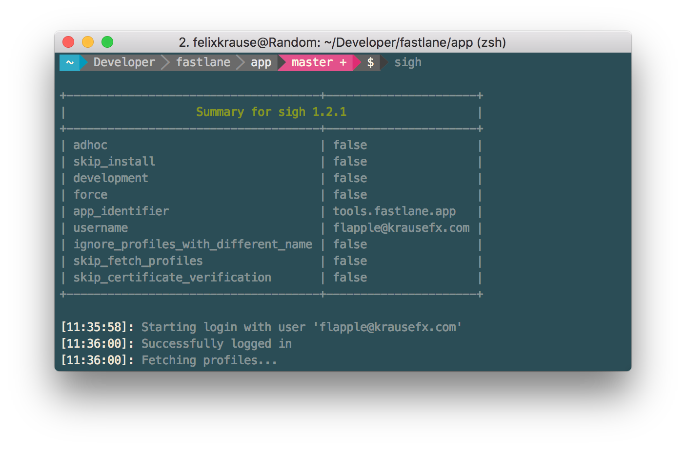
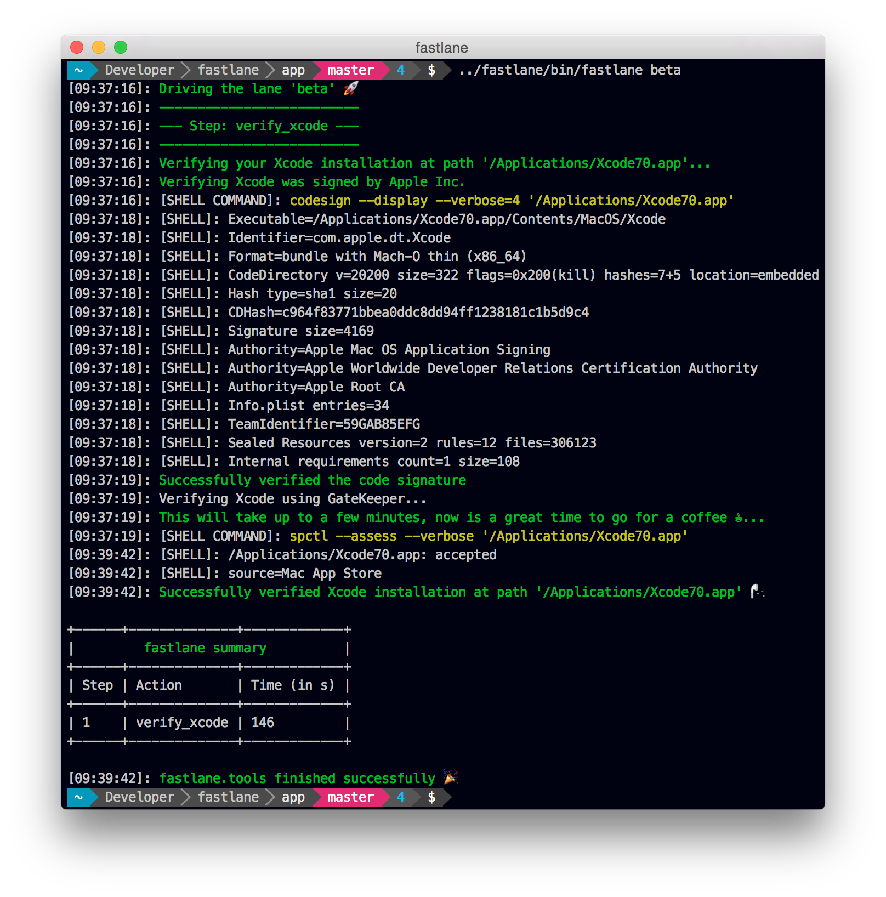

# What terminal is Felix using

Since I get asked this *every time* I tweet a picture of one of my tools, here's some information about how I set up my terminal:

- I use [iTerm2](https://www.iterm2.com/) instead of the Stock terminal Mac app
- I use [oh-my-zshell](https://github.com/robbyrussell/oh-my-zsh)
- I use [rbenv](https://github.com/rbenv/rbenv) and [rvm](https://rvm.io/) (on different computers - please only install one of them)
- I use [Solarized Dark](http://ethanschoonover.com/solarized) for the terminal colors
- I use [powerline-shell](https://github.com/milkbikis/powerline-shell) to get those cool path bars. I usually hide the host name and the user, before running `./install.py`, edit the config file and comment out `username`, `hostname`
- I use the [Meslo Powerline Font](https://github.com/powerline/fonts/blob/master/Meslo%20Slashed/Meslo%20LG%20M%20Regular%20for%20Powerline.ttf) as you need a font that supports the directory characters for `powerline`
- I use [z](https://github.com/rupa/z) an amazing tool to quickly jump between projects. Like [Alfred](https://www.alfredapp.com/) but for your Terminal reduced to folder search only
- I use the `subl .` command a lot to quickly open a specific folder in Sublime Text. This is what I use to edit my `fastlane` configuration
- `echo "gem: --no-document" >> ~/.gemrc` to stop installing docs every time you install a gem
- I use `o .` or `o filename.js` to open files (see [KrauseFx/dotfiles](https://github.com/KrauseFx/dotfiles))
- Settings -> Profiles -> Keys -> Load Preset -> Natural Text Editing
- Enable the `Show proxy icon in window title bar` option to show the folder on the window title bar for right click and drag & drop gestures
- `Profiles` -> `Advanced` -> `Semantic History` -> `Open with editor...` -> `Sublime Text 3`
- `Keys` -> Replace `Cycle Tabs ...` with `Next Tab` and `Previous Tab`

----

Also, check out [KrauseFx/dotfiles](https://github.com/KrauseFx/dotfiles) for the dot files I'm using 🚀

----
